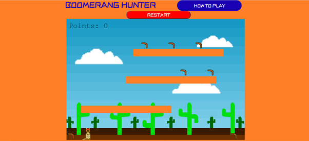

# Boomerang-Hunter-ms2

[Live Website Link](https://rdgrover.github.io/Boomerang-Hunter-ms2/)

## UX

### 1.1 Overview 

* When beginning the project I knew I wanted to create a game and was told about the Phaser library by my mentor. Using certain aspects of the library, particularly the physics simulations it was easier to create my own code to create the game. I wanted to design an homage to old-school platformer games, designed to be played on a desktop. There are simple controls and colourful design with the goal of creating a game that anyone could play but predominantely appeals to children. I wanted to create something specifically for desktops because the 8-bit platformers that I drew inspiration from are either console or desktop.

### 1.2 Project Goals 

* I liked the idea of creating something that seemed simple but you can spend hours replaying it to try and beat your best score. The aesthetic of the game is also my way of harkening back to arcade era game, with pixelated backgrounds and a sprite designed with pixel art. I chose to do this because I wanted to create something that seemed familiar and had a nostaligic feel to it whilst still creating something brand new and adding my own design to the 8-bit game style. I also wanted to create a game that didn't have a way to end the game by reaching a certain score, so that means the user is only trying to beat their own previous scores. 

### 1.3 User Goals

* A user would want simple graphics which are easy to understand and aren't overwhelming to look at.
* A user would want controls which are easy to understand and conform to general conventions of desktop games.
* A user would also want the controls to be accessible to view so that the user can become comfortable with the game before starting to play, but may also want to access the instructions during the game and they can do so at any time.
* A user would want to be able to see clearly that they are collecting items and that each item earns points.

### 1.4 Colour Scheme

* World Colours:
  * 1b00b4 - Game Title / Instructions button
  * ff0000 – Game over
  * ff7f27 – Platforms / ground / walls
  * 00dd10 – Front Cactus
  * 006707 – Back Cactus 
  * ffffff – Clouds 

* Kangaroo Colours: 
  * 8c640c – Main brown 
  * 000000- Eyes hands and nose
  * c8be7c – Pale colour for belly and ears
  * e62b08 – hat 
  * 030b51 – Eyes 
  
* Boomerang Colours: 
  * d33619 – Red stripe in center
  * 472c01 – Outer brown
  * 8b8545 – Inner brown 
  
* Dynamite Colours: 
  * d60704 – Red body
  * 8c3d04 – Brown between the red 
  * 000000 – Fuse 
  * fffca4 – Spark 

## User Stories

* As a new user I would want information on how to play the game to be visible as soon as the game is loaded.
* As a new user I would like to be able to close the modal so that I can play the game once I understand the rules.
* As a new user I would like all collectible items to spawn as soon as the game is loaded so it can be played immediately.
* As a new user I would like the controls to be responsive and for it be clear which direction I am going in.
* As a new user I would like it to be apparent how objects interact with the level.
* As a new user I would like it to be clear when interacting with the boomerangs they are being collected.
* As a new user I would like the consequence of the dynamite hitting the player to be apparent.
* As a new user I would like to be able to restart once I recieve a game over.

## Features

### 2.1 Game Board

* The level has a fixed background of desert, sky and cacti which helps to immerse you in the game and give it depth. There are three seperate platforms each moving between their own parameters at their own set speeds. The lowest platform moving the fastest, the middle platform moving at a medium speed and the highest platform moving the slowest.

### 2.2 Sprite 

* The sprite for the kangaroo main character was created using a programme called Piskel. Which allowed for the creation of multiple frames of the sprite and allowed it to be animated so it isn't just a static image that moves around the screen. This allows you to understand what direction your character is travelling in whether on the ground or in the air. There are ten frames of movement, five for left and five for right moves, and an extra frame for the stationary model. 

### 2.3 Style and Theme

* The game is based around an Australian design. It is made to look like the Australian outback with the desert plants and the orange colour scheme which is reminiscent of Australian soil. The main character is a kangaroo, the national animal of the country and the collectibles in the game are made to look like boomerangs. The primary font used for the game is ZCOOL KuaiLe and it was chosen specifically because it looks like a wild font that was reminiscent of games like Crash Bandicoot. 

### 2.4 Instructions Modal

* A modal was placed next to the title above the game window which shows you the instructions of how to play the game. As the game has quite simplistic controls and it is designed to be visually understood without context you can play the game without reading through the instructions. However, because the modal is always present you can look at the instructions at any time. 

### 2.5 Features To Be Implemented 
  
* With more time I would have liked to have added music to the game to help the immersive experience. 
  
### 2.6 Known Bugs

* Because the dynamite's speed is variable if it hits one of the walls at a very high speed it will stop moving in that direction on the x-axis and will just bounce up against 
the wall. Although it does stop moving along the x-axis the dynamite still functions and can cause a game over if hit.
  

## Wireframes

Below is the wireframe for the game created using Balsamiq:

[Boomerang Hunter Wireframe](assets/readme-assets/boomerang-wire.pdf)
  
## Technologies Utilised

* HTML5 - The project uses HTML to create the page for the game.
* CSS3 - The project uses CSS to style the HTML elements involved with the game.
* JavaScript - The project uses JavaScript for the game's logic and animations.
* Google Fonts - The project uses Google Fonts to provide the title and instructions fonts.
* Bootstrap - The project uses Bootstrap to center the game window and position the title and instructions at the top of the screen.
* Phaser Library - The project uses the Phaser Library framework to help build the JavaScript.
* GitHub - The project uses GitHub repository to store the game and for version control.
* GitPod - The project uses GitPod as the terminal for building the game.
* Git - The project uses Git to save the project and push the project into the GitHub repository.
* Balsamiq - The project uses Balsamiq to create a wireframe for the game.
  
  
## Testing

Testing is documented in seperate file - [testing.md](/testing.md)

## Deployment
 This project was deployed using GitHub pages. To do this the following steps were taken:
 1. Open the repository RDGrover/Boomerang-Hunter-ms2.
 1. From the menu at the top of the page click on the settings button.
 1. Scroll down to the GitHub pages section and select the source tab, changing it from **none** to **master branch**.
 1. After selecting **master branch** the page will be refreshed meaning the website is now deployed, scroll back down to GitHub pages and retrieve the link.
 
 To deploy locally use the following steps:
 1. Go to GitHub repository https://github.com/RDGrover/Boomerang-Hunter-ms2
 1. Click the **Clone** or **Download** button and copy the URL into the address box https://github.com/RDGrover/Boomerang-Hunter-ms2.git
 1. Open your terminal and cd to the path where you want to run the clone of the repository.
 1. Type into the terminal git clone https://github.com/RDGrover/Boomerang-Hunter-ms2.git.
 1. Once the repository has been downloaded to the designated folder, you can run the files through the browser to check if it is working.
  
## Acknowledgements
  
 * [Phaser Library](https://phaser.io/) was helpful in inspiring my project and had an abundance of physics simulators which were essential to the construction of this game.
 * One of [Phasers](https://phaser.io/tutorials/making-your-first-phaser-3-game) tutorials on building a platformer was incredibly helpful in creating base code for me to use.
 * [Piskel](https://www.piskelapp.com/) was used to create the kangaroo, boomerang and dynamite sprites as well as the background clouds, ground, walls and cacti. 
 * And special thanks to my mentor Spencer Bariball who showed me the Phaser library and was incredibly helpful every step of the way.
