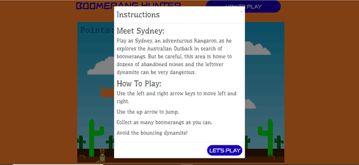
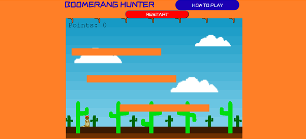
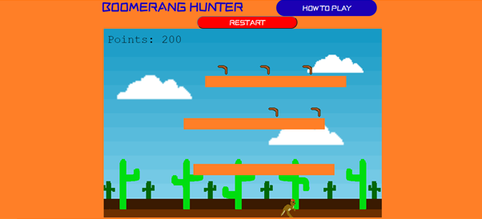
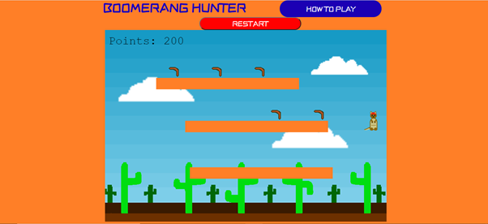

# Testing

# User Story Testing 

## As a new user I would want information on how to play the game to be visible as soon as the game is loaded.

1. As soon as the game is loaded the instructions are available in the 'How To Play' button.
1. The button for the instructions is clearly visible at the top of the screen.
1. Clicking on the button will open the associated modal which explains what the controls are and a brief backstory to the game.

Steps taken:
  * Go to Boomerang Hunter website - https://rdgrover.github.io/Boomerang-Hunter-ms2/.
  * Wait for the page to load.
  * Observe 'How To Play' button at the top of the game window.
  * Click on button to open the 'Instructions' modal.
  * Observe a modal with a brief backstory followed by the controls for the game. 
  

## As a new user I would like to be able to close the modal so that I can play the game once I understand the rules.

1. When the modal is open there is a button present labelled 'Let's Play'.
1. Clicking this button will close the 'Instructions' modal and return you to the game. 

Steps taken:
  * With modal open observe the 'Let's Play' button.
  * When hovering over the button will change the button's background colour.
  * Clicking the button will close the modal.
  * Observe the modal closing. 
  

## As a new user I would like all collectible items to spawn as soon as the game is loaded so it can be played immediately. 

1. Upon opening the game website all boomerangs immediately fall from the top of the screen.

Steps taken:
 * Go to Boomerang Hunter website - https://rdgrover.github.io/Boomerang-Hunter-ms2/.
 * Wait for page to load.
 * Observe boomerangs being created at the top of the screen and falling to interact with platforms below.
 

## As a new user I would like the controls to be responsive and for it be clear which direction I am going in.

1. Using the right arrow key moves the player sprite to the right.
1. Using the left arrow key moves the player sprite to the left.
1. Using the up arrow key allows player sprite to jump, but only if they are on the ground or a platform.
1. While jumping using the right arrow key moves the player sprite to the right.
1. While jumping using the left arrow key moves the player sprite to the left. 

Steps taken: 
 * Press the right arrow key and observe sprite animated running right and moving to the right of the screen.
 * Press the left arrow key and observe sprite animated running left and moving to the left of the screen.
 * Press the up arrow key and observe the sprite moving up the screen and then back down. 
 * Press the up arrow key when not touching the ground or platform and observe that the sprite will not jump.
 * Press the right arrow key after pressing the up arrow key and observe the sprite animated running right and moving to the right of the screen.
 * Press the left arrow key after pressing the up arrow key and observe the sprite animated running left and moving to the left of the screen.
 

## As a new user I would like it to be apparent how objects interact with the level.

1. Once the player sprite appears it should land on the ground.
1. The player should be unable to move beyond the game screen because of the walls at either side of the screen.
1. The player should be able to land on the moving platfroms and not jump through them. 

Steps taken:
 * Once the page has loaded observe the sprite drop down on to the ground.
 * Using the left arrow key the sprite will make the sprite move until it hits the wall and can no longer move.
 * Using the right arrow key the sprite will make the sprite move until it hits the wall and can no longer move.
 * Using the up arrow key to make the sprite jump observe it not jump through the moving platform if the platform is above.
 * Using the up arrow key to make the sprite jump observe the sprite land on the moving platform provided there is no platform above when jumping.

1. Once boomerangs appear at the top of the screen they should land on the moving platforms or the ground.
1. The boomerangs will not be able to go through the walls at the end of the screen.

Steps taken:
 * Once the page has loaded observe the boomerangs drop from the top of the screen.
 * Observe that the boomerangs will bounce but settle on the ground and platforms.
 * Collect the first seven boomerangs to make others appear.
 * Observe the random spawning of the boomerangs. 
 * Since they appear randomly and the platforms are constantly in motion there is a possibility they will bounce towards the wall, if this happens observe they bounce off the wall.

1. When the dynamite is created it will bounce around the screen.
1. It will bounce off of the walls, ground and moving platforms.

Steps taken:
 * Move the sprite around the screen to collect the first seven boomerangs which appear.
 * Observe the first dynamite being created at the top of the screen.
 * Observe the dynamite bounce off of the moving platforms, walls and ground. 
 * If it is underneath a platform observe it not pass through the platform but rather will bounce of the underside of the platform. 

## As a new user I would like it to be clear when interacting with the boomerangs they are being collected.

1. Once the boomerang and the sprite are touching the boomerang will be collected and disappear.
1. The points in the corner will increase by 100 points to show how many have been collected.

Steps taken: 
 * Use the arrow keys to move the player sprite towards the nearest boomerang.
 * Observe once the sprite makes contact with the boomerang the boomerang disappears.
 * Observe the points value in the corner increase by 100 for every boomerang collected.

## As a new user I would like the consequence of the dynamite hitting the player to be apparent.
 
1. Once the first seven boomerangs are collected the first dynamite will appear and begin to bounce around.
1. Every time all seven boomerangs are collected another dynamite will be created.
1. If the dynamite collides with the player the game will end.

Steps taken: 
 * Use the arrow keys to navigate the level and collect the first seven boomerangs.
 * Move the player into the path of the dynamite.
 * When the dynamite hits the player observe the player sprite and dynamite disappear from the screen.
 * Observe that after the player has been hit a message reading 'You got hit' and 'Game Over' will appear. 

## Website Compatibility 

The game is compatible with the following browsers - 
* Google Chrome
* Microsoft Edge
* Internet Explorer
* Firefox
* Safari

## Device Compatibility

The game is designed for a desktop/laptop and requires a keyboard to play. However, the game does work on a tablet or a smart phone with a bluetooth keyboard enabled.
Although it does work on a phone game screen is not centered as it is not designed for a screen that small.

Insert screenshots

## Automated Tests

I used W3 to check my HTML and CSS code to ensure there were no issues. These are the steps I took:

#### For HTML code
1. Go to https://validator.w3.org.
1. Enter the following url https://rdgrover.github.io/Boomerang-Hunter-ms2/index.html into the check by address bar and click **Check**.
1. Confirm there are no errors or warnings.

#### For CSS code
1. Go to https://jigsaw.w3.org/css-validator/.
1. Enter the following url https://rdgrover.github.io/Boomerang-Hunter-ms2/assets/style.css into address bar and click **Check**.
1. Confirm there are no errors or warnings.

#### For JavaScript code

1. Go to repository https://github.com/RDGrover/Boomerang-Hunter-ms2.
1. Open **assets** folder.
1. Click on the **game.js** file and you should see the Javascript code.
1. Highlight and copy all the code.
1. Open url https://jshint.com/.
1. Paste the copied code into the window where instructed.
1. Confirm that there are no errors.

 
 
